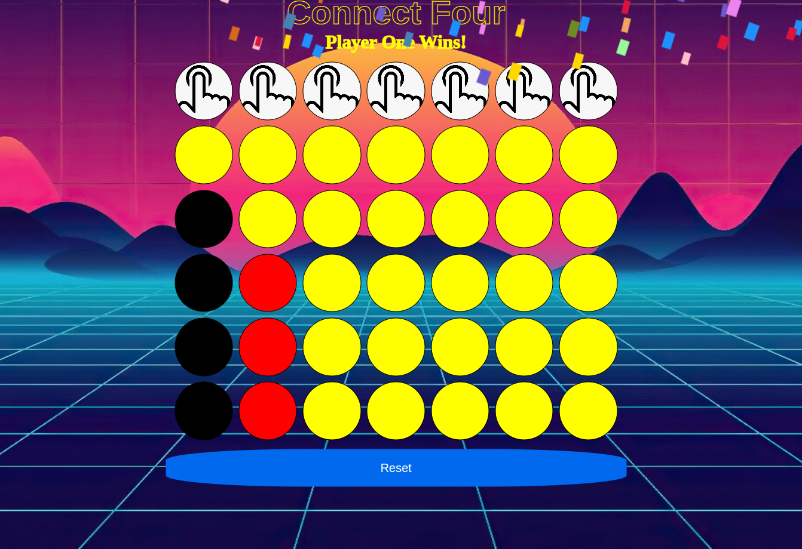

# A Connect Four Browser-Based Game

#### Connect Four is a classic 2 player game that brings back happy childhood memories

### Getting Started:
Game link: https://peaceful-kashata-d078be.netlify.app/

### How to play:

1. Player 1 starts by clicking on one of the top 7 spaces in the grid to drop a token into the slot. 

2. Player 2 then does the same.

3. The winner is the first one to line up 4 tokens in a row vertically, horizontally or diagonally

### Technologies used: 
JavaScript, HTML, CSS

### Iceboxes: 
1. Add scoreboard to count wins from multiple plays
2. Add dark more
3. Add more sound effects
4. Add computer opponent